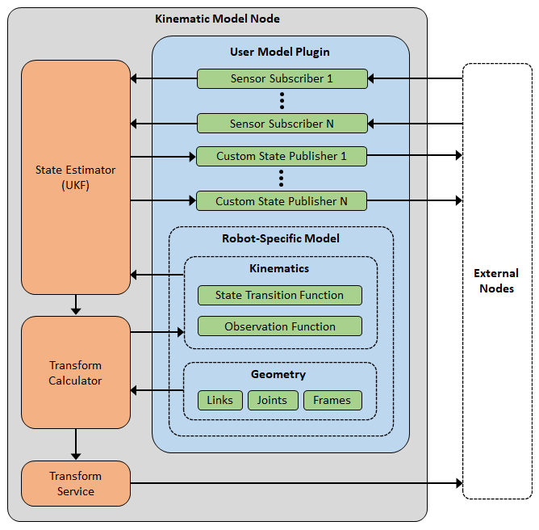

# kinematic_model
A C++ library for implementing a kinematic model of a dynamic object.

## Table of Contents
1. [Overview](#1-overview): Brief introduction to the `kinematic_model` library
2. [Details](#2-details): Detailed information about library features and functionality
3. [Dependencies](#3-dependencies): Dependencies required for using this library.
4. [Usage](#4-usage): Instructions for using the library

## 1: Overview

The `kinematic_model` library provides two primary functions:
1. Internally model the kinematics of a robot using an Unscented Kalman Filter (UKF)
2. Provide real-time calculations of transforms between coordinate frames (alternative to tf/tf2)

At a high level, this library allows the user to extend the `kinematic_model_t` class to define the geometry & kinematics of their robot. The class can then be used to perform state estimation and calculate geometric transforms.

**Features:**

- OOP structure allow models to be easily created and run for any type of robot.
- Centralizes state estimation and transform calculation, increasing efficiency and reducing computational complexity.
- Internally handles nonlinear state estimation for more accurate, real-time estimations of the robot's state (e.g. pose, joint positions, etc.)
- Transform calculations are more accurate since they are based on state estimations and not raw, noisy sensor data
- Extremely high-efficiency calculation of transforms between coordinate frames

**Advantages over tf2:**

- Orders of magnitude increase in efficiency for both computation and bandwidth
- Transforms are calculated with higher accuracy thanks to integration with state estimation
- Nodes (especially sensor drivers) do not need to broadcast transform information and do not need awareness of robot geometry (e.g. frames)

**Tutorials:**

TODO

## 2: Details

The `kinematic_model` library provides a base class for modeling the kinematic state of a robot in real-time while simultaneously providing calculation of geometric transforms.

At a high level:
1. The user extends the base `kinematic_model` class to define the robot's geometry and models it's kinematics
2. The user's extended class provides sensor data and runs iterations of the base class's underlying Unscented Kalman Filter (UKF).
3. The `kinematic_model` class provides public transform calculations at any time.

### 2.1: Extended Class

In order to use `kinematic_model`, the user must extend the base `kinematic_model_t` class to fill four primary responsibilities:

**Responsibility 1: Specify the robot geometry**

The `kinematic_model` node needs to understand the robot's geometry in order to calculate transformations between the robot's various frames. This library uses a special "design" structure that allows the derived class to create and connect geometry objects. These objects include:

- Links: A single, physical body within the robot.
- Joints: A dynamic connection between two links.
- Frames: A user-defined coordinate frame that can be attached to a link or joint.

These objects are connected via "attachments". An attachment may be fixed or dynamic, and there are no limitations on which objects can be attached together. For example, you may connect two links with a fixed attachment. You may also connect multiple joints together in series to create a 3DOF ball joint.

Joints and dynamic attachments must be tied to variables in the model's state vector. Take for example a revolute joint, which has a single axis of rotation. There must be a variable in the model's state vector that describes the angular position of that joint. This allows `kinematic_model` to internally calculate transforms using the real-time model state.

For simplicities sake, only two types of joints exist: revolute and prismatic. You may directly attach multiple joints together (without a link inbetween) to create more complex joints, such as a universal joint or a ball joint.

One may ask why `kinematic_model` doesn't use URDF or SDF for specifying robot geometry, and the answer is simple: both URDF and SDF use limiting and counter-intuitive methods for attaching geometry objects together. This library uses a custom procedure which drastically simplifies the process of "building" a robot geometry model while simultaneously allowing more flexibility.

**Responsibility 2: Model the robot's kinematics**

The `kinematic_model` base class needs to understand the robot's kinematics in order to perform state estimation. This library internally uses an Unscented Kalman Filter (UKF) from the [kalman_filter](https://github.com/pcdangio/kalman_filter) library for running state estimation calculations. The extended class must specify two different models:

1. State Transition Model: Predicts the current state of the model based on the previous state (and inputs if present)
2. Observation Model: Maps sensor measurements to variables in the model state.

These models are specified by overriding the base class methods for `state_transition()` and `observation()`. See the [Usage](#4-usage) section for more details.

The extended class's model functions may directly access transforms from it's base class using the `get_transform()` function. Many observation models require transformations to map sensor measurements to states, for example mapping a GPS measurement from the "gps_sensor" frame to a state represented in the "robot" frame.

Because the `kinematic_model` uses a UKF, it can handle both linear AND nonlinear models. It also doesn't require you to specify Jacobians (like with the Extended Kalman Filter), drastically simplifying the model while still being able to handle nonlinearity.

The extended class is also responsible for setting the process covariance matrix, Q. The matrix is stored by the base class, and may be set once or modified at any time by the extended class.

**Responsibility 3: Provide the internal state estimator with sensor measurements**

The extended class must receive sensor measurements and pass them on as observations to the `kinematic_model`'s state estimator. The reason for this is that each robot uses different sensors, so the robot-specific extended class is the correct place to subscribe to sensor data. Each time a new sensor measurement is received, the extended class must pass it into the state estimator via the `new_observation()` function. See the [Usage](#4-usage) section for more details.

A great feature of the `kinematic_model`'s state estimator is that it can handle measurements that arrive at different/variable rates. The state estimator will use whatever measurements are available when performing its "measurement update" step.

An added bonus of this approach is that `kinematic_model` may use data from sensor drivers without imposing any requirements on the sensor drivers themselves. In ROS tf2, sensors are tasked with sending transform messages. This is a form of contamination, as a sensor node must programmatically depend on tf2 and also have knowledge of robot-specific coordinate frames. The `kinematic_model` library removes this contamination, making the environment more elegant. It also means that `kinematic_model` can use data from ANY type of software component.

The extended class is also responsible for setting the measurement noise covariance matrix, R. The matrix is stored by the base class, and may be set once or modified at any time by the extended class. Take for example the ROS [sensor_msgs/NavSatFix](http://docs.ros.org/en/api/sensor_msgs/html/msg/NavSatFix.html) message, which includes both a GPS measurement and covariance. In a subscriber's callback, your extended class may pass the measurement in via `new_observation()` and then update the R matrix using the real-time covariance measurements provided in the message.

**Responsibility 4: Iterate the state estimator**

The base class provides an `iterate()` method that must be called regularly by the extended class to perform state estimation. This can be run at any desired rate, and after the method is called, the extended class can make use of updated state information (e.g. publishing it to external software components).

### 2.2: Base Class

The `kinematic_model_t` base class is the class that must be extended. It contains all functionality related to state estimation and transform calculation. It has two primary responsibilities:

**Responsibility 1: Estimate the kinematic state of the robot**

The base class uses an internal Unscented Kalman Filter (UKF) from the [kalman_filter](https://github.com/pcdangio/kalman_filter) library for performing real-time, nonlinear state estimation. Each time the extended class calls the base `iterate()` method, the base class's internal UKF:

1. Performs an prediction step using the extended class's state transition model.
2. Uses available measurements to perform a measurment update step.

Ultimately, this allows `kinematic_model` to calculate more accurate estimates of the actual kinematic state of the robot.

See the [kalman_filter](https://github.com/pcdangio/kalman_filter) library for additional detail on how the internal state estimator works.

**Responsibility 2: Calculate transforms on an as-needed basis**

The base class provides a real-time transform calculation capability for use in two different scenarios:

1. The extended class may internally use the protected `get_transform()` function to get transforms as needed. For example, the extended class's `observation()` model function may use it to get transforms for mapping sensor measurements to state variables.
2. External classes may use the public `get_transform()` function to also retrieve transforms as needed. The public method uses the last calculated state vector for calculations, and also caches transforms for reuse between `iterate()` calls.

The transform capability is broken into two areas: the geometry graph and transform calculation. The geometry graph builds a representation of the robot's physical structure using the "design" structure provided by the extended class. When a transform is requested, the graph is used to find the path between the request's source frame and target frame. The path is an ordered list of geometric objects (links, joints, frames) that must be traversed to get from the source frame to the target frame. The `kinematic_model` library uses a custom-designed graph for extreme efficiency in solving geometric paths. It also uses internal caching to prevent duplicative computations of paths.

Once a path is solved between the source and target frames, the transform calculator is used to find the transform between the source and target frame. Recall that geometric objects (links, joints, frames) are all connected via attachments, which are static or dynamic poses between the parent object and the child object. The transform calculator steps through each attachment in the objects path, and chains transforms together to calculate the final transform from source to target. Furthermore, joints are special objects in that a joint's position is a transform. So as the transform calculator steps through the path, it chains both attachment transforms AND joint transforms. Dynamic attachments and joints each depend on variables in the kinematic model's state. These state variables (e.g. joint position, attachment pose, etc) are constantly being updated by the `kinematic_model`'s state estimator. The transform calculator uses the real-time state variables when calculating these transforms, so as a joint position changes, the calculated transform through that joint also changes.

Compared to tf2, `kinematic_model`'s centralized transform calculation strategy offers significant increases in accuracy, computational efficiency, and bandwidth efficiency:

| `kinematic_model` | tf2 |
| - | - |
| All coordinate frame transforms calculated in a single place with zero duplication | Every node must calculate it's own coordinate frame transforms, causing significant numbers of duplicate calculations |
| Specific transforms are calculated only when requested | Every transform is calculated and published to all nodes regardless of if/when they are needed |
| Can receive data from any sensor drivers or software component | Only compatible with sensor nodes that depend on tf2 and publish tf2 messages |
| Sensor drivers do not need awareness of robot geometry | Sensor nodes must be programmed or configured to understand robot-specific frames/geometry |

## 3: Dependencies

- [kalman_filter](https://github.com/pcdangio/kalman_filter): A C++ library for Kalman Filtering.
- [transform](https://github.com/pcdangio/transform): A C++ library for geometric transforms.
- [Eigen3](https://eigen.tuxfamily.org/index.php?title=Main_Page): A C++ library used for matrix/vector calculations.

## 4: Usage

TODO: link to examples repository.